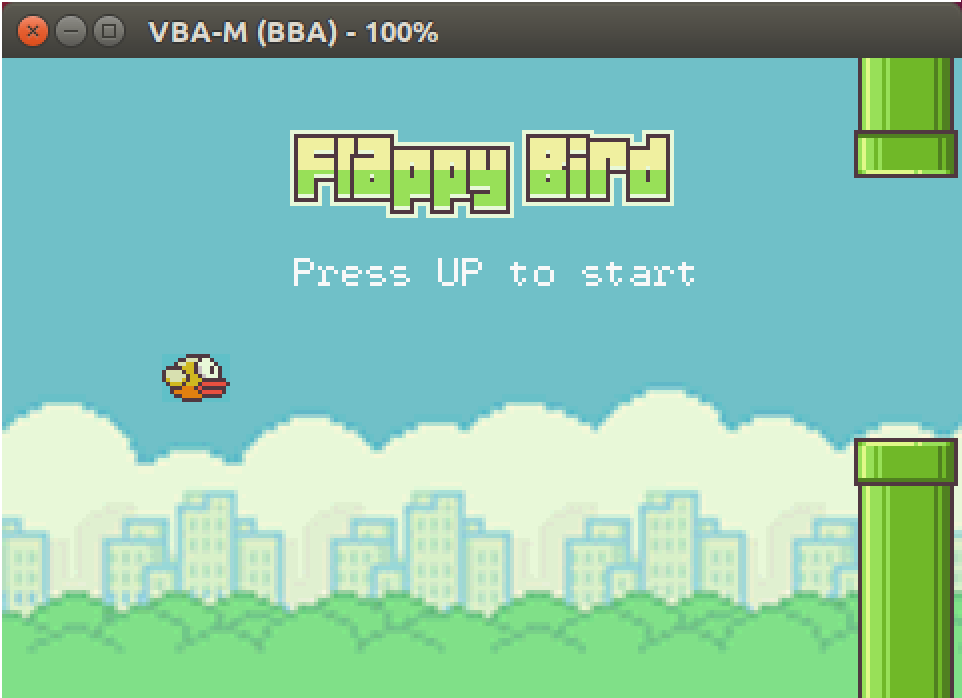

# Bio

This is Jianing Yang. I am a fourth-year CS student at [Georgia Tech](http://gatech.edu). I work as an undergraduate research assistant at [SunLab](http://sunlab.org), advised by [Prof. Jimeng Sun](https://www.cc.gatech.edu/people/jimeng-sun).

In the past summers, I interned as a Software Development Engineer at Amazon Web Services (AWS).

My research interests are in Natural Language Processing, Machine Learning and Healthcare Analytics.

# Projects

## [Flappy Bird @ Game Boy Advance](https://github.com/jedyang97/flappy-bird-gba)
GBA version of the famous Flappy Bird game. 

